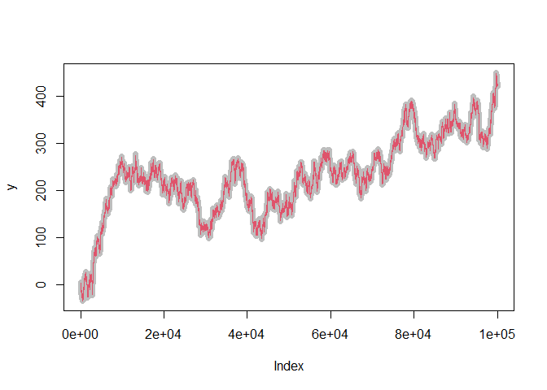

<!-- README.md is generated from README.Rmd. Please edit that file -->

# packageC

<!-- badges: start -->
<!-- badges: end -->

The goal of packageC is to make a minimal example using C code in R
package.

## Installation

You can install the development version of packageC from
[GitHub](https://github.com/) with:

``` r
# install.packages("devtools")
devtools::install_github("jstatlab/packageC")
```

## Example

Follow a basic example:

``` r
library(packageC)

y <- cumsum(rnorm(1e5))

plot(y, col = "grey")
lines(exp_smooth(y, 0.8), col = 2)
```



You’ll still need to render `README.Rmd` regularly, to keep `README.md`
up-to-date. `devtools::build_readme()` is handy for this.
